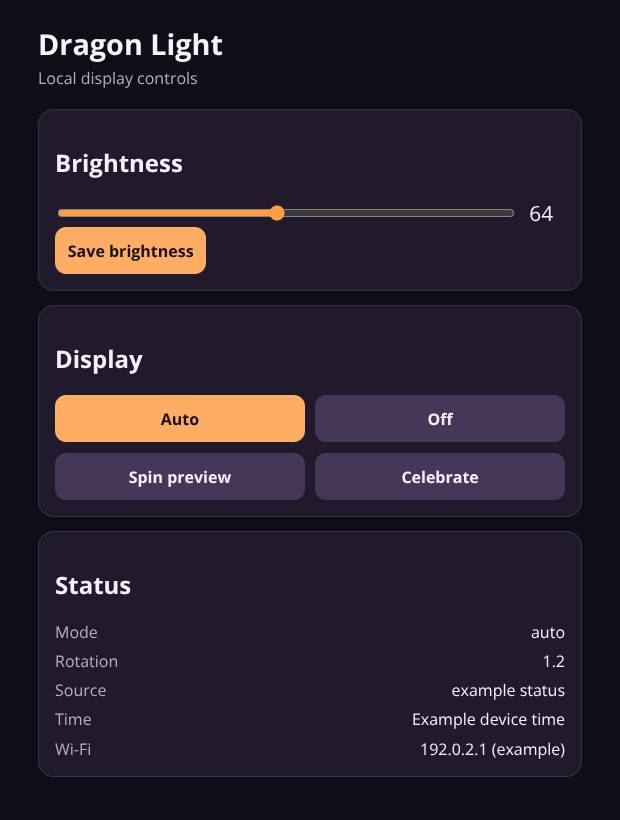

# Dragon Light

A small classroom display that answers a surprisingly common question: **what day of the rotation is it?**

My school uses an eight-day schedule spelled **B E D R A G O N**. Dragon Light turns that schedule into one illuminated character, visible at a glance. It also counts down the final minutes before class and turns off overnight.

This project combines classroom experience, physical making, and embedded software. The design aim is a useful object that can sit quietly in a room, rather than another screen competing for attention.

## Preview



The firmware's local control page, rendered with example device status. This shows brightness and animation controls; a photograph of the physical classroom display would complement it.

[Capture notes](docs/previews/README.md) record the source revision and demo conditions.

## Where it stands

**Working hardware prototype.** The project notes record successful USB flashing, Wi-Fi provisioning, and basic LED rendering. The full physical LED-map scan, power-supply rating, and on-device calendar sync still need confirmation. Those checks remain open; firmware features alone are not evidence of a finished installation.

## How it works

- An ESP8266 drives a custom 16-segment display using addressable LEDs.
- A public calendar supplies the rotation letter, with a cached CSV fallback.
- A local web page controls brightness and previews animations.
- Wireless firmware updates support a display mounted out of reach.
- Missing schedule data produces an unknown indicator rather than a guessed day.

The firmware separates the physical LED routing from letters, effects, and scheduling. That makes it possible to change the enclosure or strip layout without rewriting the rest of the display.

## Explore the project

| If you want to… | Start here |
| --- | --- |
| Understand the decisions and remaining checks | [Project notes](docs/PROJECT_NOTES.md) |
| Build, configure, or troubleshoot the display | [Build and operating guide](docs/BUILD_GUIDE.md) |
| Review the wiring | [Hardware notes](docs/HARDWARE.md) |
| Understand the custom segment layout | [LED mapping](docs/LED_MAPPING.md) |
| Read the firmware | [Main application](src/main.cpp), [display mapping](src/display.cpp), [schedule handling](src/schedule.cpp) |

## Build the firmware

Requires PlatformIO. From the repository root:

```bash
pio run -e usb
```

Flashing and installation need the hardware and local configuration described in the build guide.

**Stack:** C++ · ESP8266 Arduino Core · FastLED · WiFiManager · PlatformIO.

The enclosure uses a purchased 3D model; its files are not redistributed here. Credits and installation limitations are documented in the [build guide](docs/BUILD_GUIDE.md). Project code is [MIT licensed](LICENSE).
