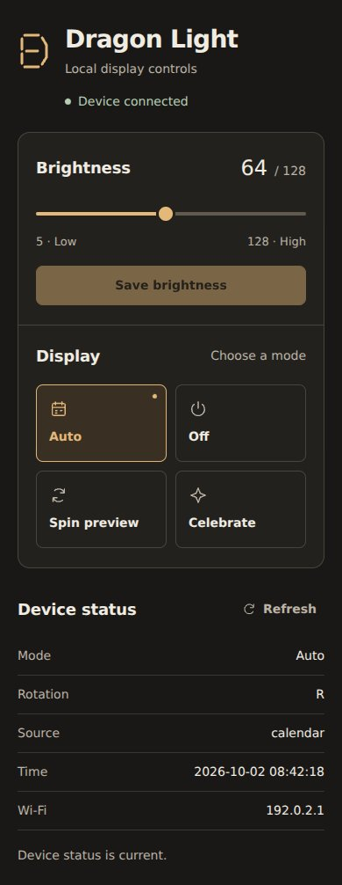

# Preview capture notes

Captured 2026-10-02 (UTC) from the interface refinement included in this commit, based on source commit `8ee336067372c4dea240c39f8a0e411a053bee21`.

Exact HTML extracted from `include/web_ui.h` and served locally. Desktop capture: 1440 × 1000. Mobile capture: 390 × 900. The API responses used example values matching `statusJson()`; `192.0.2.1` is a documentation address. No device connection, flashing, LED validation, or calendar synchronization.

Browser checks covered layouts at 320, 390, 760, and 1440 pixels; keyboard brightness adjustment; pending requests; selection of all four modes; preservation of unsaved brightness during polling; rejected requests; connection recovery; unknown schedule data; focus visibility; and reduced motion. Mode requests use the firmware's `spin` and `celebrate` values, while selected buttons recognize its `spin preview` and `celebration preview` status names.

The system font stack keeps the page self-contained on the ESP8266. The slider's two-color track represents the actual brightness value. These are intentional constraints of the local device interface.

`python -m platformio run -e usb` compiled successfully for NodeMCU ESP8266 with FastLED 3.10.5 and WiFiManager 2.0.17: 35,516 bytes of RAM (43.4%) and 451,503 bytes of flash (43.2%). The local preview helper was also checked against its brightness, mode, status, and validation endpoints. Compilation and browser checks do not replace on-device testing.

The screenshots document a local interface or fixture output. They do not establish production readiness. No credentials, paid provider requests, live account operations, or personal data were used.
